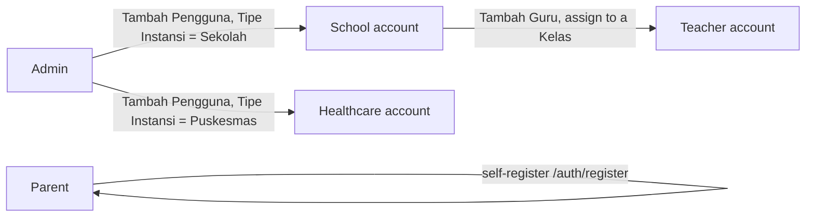
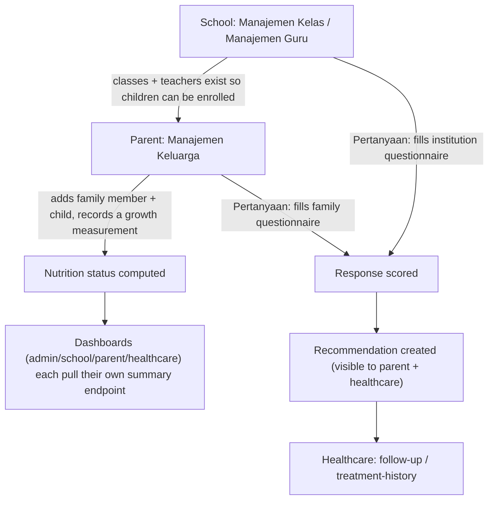

# Jalinan Anak Sehat — Frontend

Web app for monitoring child nutrition/growth, connecting parents, schools, Puskesmas (healthcare), and an admin back-office. React 19 + Vite SPA, served in production behind a small Express proxy (`server.js`) so the backend API is reached same-origin (keeps the refresh-token cookie first-party).

- **Production:** https://jalinananaksehat.com (proxies `/api/*` to the backend)
- **Backend:** [`be_projectapp`](../be_projectapp) — Node/Express + `mysql2`, deployed separately (Openship)
- **QA status / known bugs:** see [`docs/QA-BUGS.md`](docs/QA-BUGS.md)

## Tech stack

- React 19, React Router 7, Vite 6, Tailwind CSS 4
- Formik for forms, SWR for data fetching/caching, Axios for HTTP
- Preline UI (headless components initialized via `HSStaticMethods.autoInit()` — see [Gotchas](#gotchas))
- `react-toastify` for notifications, `recharts` for charts, Tiptap for rich text
- Production runtime: Express + `http-proxy-middleware` (`server.js`) serving the built `dist/` and proxying `/api`

## Getting started

```bash
npm ci
cp .env_example .env   # fill in VITE_BASE_URL / API_PROXY_TARGET, see below
npm run dev            # vite dev server, proxies /api to API_PROXY_TARGET (vite.config.js)
```

Other scripts: `npm run build` (production bundle to `dist/`), `npm start` (runs `server.js` against a built `dist/`), `npm run lint`, `npx vitest`.

**There is no staging/local backend.** `API_PROXY_TARGET` in `.env` points at the real production backend (`https://apis.jalinananaksehat.com`) — running `npm run dev` or `npm start` locally reads/writes the production database. Treat any local testing accordingly (use clearly-named test accounts, clean up what you create).

### Environment variables

`VITE_*` vars are inlined into the client bundle at build time. `API_PROXY_TARGET` is server-only (read by `server.js`, never sent to the browser). See `.env_example` for the full list — most `VITE_API_*` vars are just relative endpoint paths (e.g. `VITE_API_LOGIN=auth/login`) appended to `VITE_BASE_URL` by the pages/hooks that use them.

## Deployment

Push to `main` triggers `.github/workflows/deploy.yml`: build → upload via FTP to Rumahweb shared hosting → **sync step (see below)** → recycle the LiteSpeed Node worker.

**Gotcha:** the FTP account used for deploys is jailed to `public_html/<domain>/ftp_jalinananaksehat/`, which is a *different* directory than where the app actually runs (`$HOME/<domain>/`, where `server.js`'s LiteSpeed/Passenger worker lives). A dedicated workflow step SSHes in and mirrors the FTP-uploaded files into the live directory before recycling the worker — without it, deploys silently "succeed" while the live site keeps serving a stale build. If a deploy seems to have no effect, check that sync step first, not the build/FTP steps.

## Application flow

### Roles and top-level navigation

Auth is JWT (access token in memory + refresh token as an HttpOnly cookie, same-origin via the `server.js` proxy). `ProtectedRoute` (`src/routes/guardsRoute/ProtectedRoute.jsx`) gates every `/admin`, `/school`, `/parent`, `/healthcare` route client-side by `user.role`, redirecting to that role's own dashboard (or `/auth/login` if unauthenticated) — `teacher` redirects into the school area, `staff` into the healthcare area, alongside the four primary institution-level roles.

```mermaid
flowchart TD
    Landing["/landing-page (public)"] --> Login["/auth/login"]
    Landing --> Register["/auth/register (parent self-service)"]
    Landing --> Game["/game (public mini-game)"]

    Login -->|role: admin| AdminDash
    Login -->|role: school / teacher| SchoolDash
    Login -->|role: parent| ParentDash
    Login -->|role: healthcare / staff| HealthDash

    subgraph Admin["Admin — /admin/*"]
        AdminDash[dashboard]
        AdminUsers[management-users]
        AdminQuestion["question (3 category tabs)"]
        AdminInstitution[institution]
        AdminCategory[category]
    end

    subgraph School["School — /school/*"]
        SchoolDash[dashboard]
        SchoolTeachers[management-teachers]
        SchoolClasses[management-classes]
        SchoolStudents[management-students]
        SchoolPartners[management-partners]
        SchoolQuesioner[quesioner]
    end

    subgraph Parent["Parent — /parent/*"]
        ParentDash[dashboard]
        ParentFamily[management-family]
        ParentQuesioner[quesioner]
        ParentRecommendation[recommendation]
    end

    subgraph Healthcare["Healthcare / Puskesmas — /healthcare/*"]
        HealthDash[dashboard]
        HealthRecs[list-of-recommendations]
        HealthFollowUp[follow-up]
        HealthHistory[treatment-history]
        HealthStaff[staff-management]
    end
```



### Account provisioning

- **Admin** accounts are seeded directly (not self-service).
- **School** and **Healthcare/Puskesmas** accounts are institution accounts created *by an admin* (Manajemen Pengguna → "Tambah Pengguna"), which creates the institution + its admin user together in one step, distinguished by "Tipe Instansi" (Sekolah vs Puskesmas).
- **Parent** accounts are self-service (`/auth/register`).
- **Teacher** accounts are created *by a school* (Manajemen Guru → "Tambah Guru"), scoped to one of that school's classes.



### Core data flow: nutrition monitoring



## Gotchas

- **`VITE_BASE_URL` double-prefix:** `src/lib/api.js` already configures axios with `baseURL: VITE_BASE_URL` (`/api/`). Call sites must pass a *relative* path (`statistics/...`) — prepending `VITE_BASE_URL` again produces `/api/api/...` and 404s. This bug existed in ~9 call sites and was fixed; if you add a new API call using the shared `api` instance, don't repeat the prefix. (`recommendationAPI.js` has a few calls that use a *separate*, unconfigured `axios` instance and correctly do need the full prefix — check which client a file imports before copying a pattern from it.)
- **Preline widgets + async data:** Preline components (`data-hs-select`, datepickers, etc.) are initialized by calling `HSStaticMethods.autoInit()` after the relevant DOM exists. If a component renders behind a loading gate (e.g. `if (!data) return <Skeleton />`), a `useEffect(() => autoInit(), [])` with an empty dependency array runs *before* the real markup exists and never re-runs — the widget silently never initializes. Depend the effect on the data that gates the render (see `src/pages/dashboard/parent/Family.jsx` for the working pattern, and the fix in `src/pages/dashboard/school/teachers.jsx`).
- **No staging environment:** local dev and any local `npm start` talk to the production backend/database. QA and manual testing happen directly against production — use obviously-named test data and clean it up.
