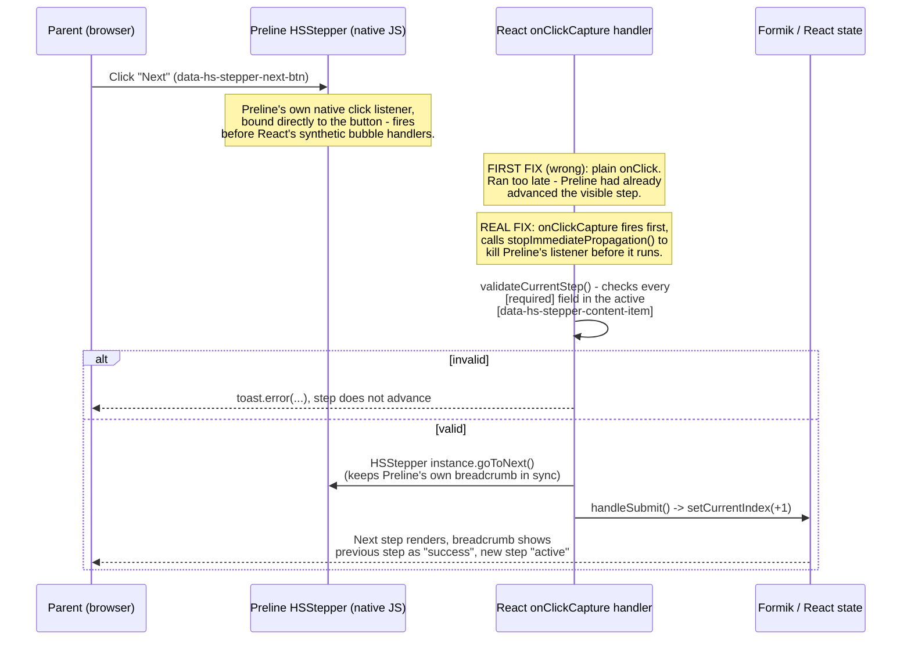
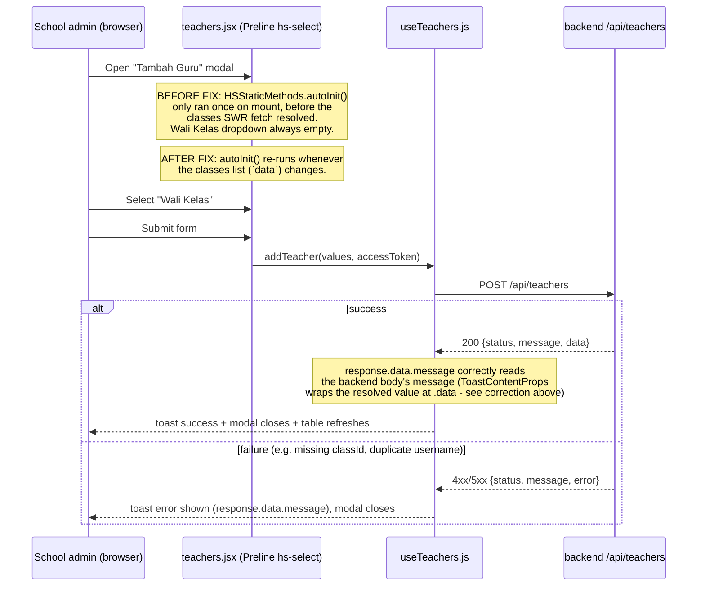

# QA Findings & Application Flow — Jalinan Anak Sehat

Last updated: 2026-09-08
Scope: two QA passes against production (`jalinananaksehat.com` / `apis.jalinananaksehat.com`), both via Playwright:
1. An initial exploratory pass (admin + fresh school/parent accounts).
2. A full **TP/TN/FP/FN** pass across **all four roles** (admin, school, parent, healthcare — healthcare tested for the first time), one role logged in and tested to completion at a time in a single browser session (running roles concurrently was tried first and abandoned — see [Methodology note](#methodology-note)).

Every bug found in both passes is now fixed and deployed.

**Methodology:** every test case is classified as:
- **TP (True Positive):** valid input/action → system correctly succeeds.
- **TN (True Negative):** invalid input/action → system correctly rejects/blocks it (clear error, not a crash).
- **FP (False Positive) — bug:** invalid input/action → system incorrectly *accepts* it (missing validation, or an authorization boundary that should block a role but doesn't).
- **FN (False Negative) — bug:** valid input/action → system incorrectly *rejects* or fails it (overly strict validation, broken widget, crash, silent failure).

## Bug tracker — all closed

| # | Feature / Page | Class | Severity | Status | Summary |
|---|---|---|---|---|---|
| 1 | School → Manajemen Guru → Tambah Guru | FN | 🔴 Critical | ✅ Fixed (`1f15c51`) | "Wali Kelas" dropdown never populated (Preline widget initialized before class data loaded), so submit always failed backend-side (`ID kelas harus disertakan`, 500). |
| 2 | School → Manajemen Guru → Tambah Guru (error handling) | FN | 🔴 Critical | ✅ Fixed (`1f15c51`, reverted+fixed properly in `689e6fc`) | Believed at first to be a crashing error toast (`response.data.message` on an already-unwrapped body). That diagnosis was **wrong** — see the callout below. The real, narrower issue was only the dropdown (#1); the toast plumbing was already correct. |
| 3 | Admin → Dashboard vs Manajemen Pengguna | Minor | 🟡 Minor | ✅ Fixed (`f99ef40`) | "Total Pengguna" excluded admin accounts, Manajemen Pengguna's "Total Rows" didn't — removed the exclusion so both counts agree. |
| 4 | School → Manajemen Mitra → Tambah Mitra modal | Minor | 🟡 Minor | ✅ Fixed (`80cbf37`) | Removed the `data-hs-overlay-keyboard="false"` directive that was disabling Escape-to-close (likely copy-pasted from the Tambah Guru modal, where it's intentional). |
| 5 | Parent → Manajemen Keluarga → Tanggal Lahir field | Minor | 🟡 Minor | ✅ Fixed (`a6f959b`) | HSDatepicker has no public close method; the fix reaches into the vanilla-calendar-pro instance it wraps and calls `.hide()` in the change handler. |
| 6 | Multiple pages (Manajemen Pengguna, Manajemen Pertanyaan, notifications) | Minor | 🟡 Minor | ✅ Fixed (`80cbf37`) | 11 table components had a redundant manual `mutate()` effect firing *alongside* SWR's automatic refetch-on-key-change — same root cause as #10. Removed the redundant effect everywhere it appeared. |
| 8 | Parent → Manajemen Keluarga wizard | FP | 🟠 High | ✅ Fixed (`a6f959b`, breadcrumb regression fixed in `ca72247`) | See the detailed writeup below — this one had a genuinely tricky root cause (a UI library racing against React). |
| 9 | School → Manajemen Kelas → Tambah Kelas | FP-adjacent | 🟡 Minor | ✅ Fixed (`07d4be0`, backend) | `createClasses` now checks every name in the batch for a duplicate *before* inserting anything; if any conflict, the whole batch is rejected with `409` instead of silently skipping duplicates and returning 200. |
| 10 | Admin → Manajemen Pengguna → search + pagination | Minor | 🟡 Minor | ✅ Fixed (`80cbf37`) | Root cause: `page`/`pages`/`rows` were local state re-synced from each fetch response — a stale in-flight request resolving after a fresh search could overwrite the correct new page index. Fixed by deriving `pages`/`rows` straight from the current SWR `data` and never writing `page` back from a response at all. |
| 11 | Admin → Manajemen Pengguna → Tambah Pengguna (duplicate username) | Debug leftover + status code | 🟡 Minor | ✅ Fixed (`99770d1`, `417b5f9`) | `signUpInstitution` had a stray `console.error(error)` not present in any sibling auth function — removed. Also changed the duplicate-username/email/institution rejection from `500` to `409 Conflict` (client error, not a server fault). |
| 12 | Parent → Pertanyaan (fresh account, no family data) | Minor | 🟡 Minor | ✅ Fixed (`e83c6bc`) | Gated all 3 background effects (checking/response/history) behind a `hasFamilyMembers` check, fetched via the same SWR cache key `FamilyMemberGuard` already uses (so it's a cache hit, not an extra request). A fresh account now fires zero `/api/response/*` requests instead of several guaranteed-to-fail ones. |
| 7 | Cross-cutting — notifications / backend stability under load | Operational | ⚪ Info | Not a code bug | Transient `ECONNRESET`/connection-timeout window seen during the heaviest QA run, consistent with DB-connection/LiteSpeed-worker pressure already diagnosed earlier this session. Not something to "fix" in this repo — flagging for infra awareness only. |

Previously fixed this same session, listed for context (infra, not app-feature bugs):
- Backend on Openship couldn't reach the database (Rumahweb firewall/IPS blocked the new server IP) — resolved once Rumahweb whitelisted `103.14.20.91`.
- 9 frontend API call sites double-prefixed `/api/api/...` — fixed in `bde5728`.
- CI/CD: FTP deploys were silently landing in the wrong (jailed) directory on Rumahweb and never reaching the live app root — fixed by adding a server-side sync step in `0831f01`.

## ⚠️ Important correction: bug #2's original diagnosis was wrong

`1f15c51` changed `useTeachers.js`'s `toast.promise` renderers from `response.data.message` to `response.message`, reasoning that since `createTeacher`/`putTeacher`/`dropTeacher` already unwrap the axios response, `response` in the render callback must already be the backend body directly.

**That reasoning was wrong.** react-toastify's `toast.promise` render callback receives `ToastContentProps<T> = {closeToast, toastProps, isPaused, data: T}` — the resolved/rejected value lives at `.data`, not at the top level. So `response.data.message` was correct all along, and the "fix" made every teacher create/update/delete toast silently show `"undefined"` instead of the real message — a real regression, caught and reverted in `689e6fc` before it reached anyone.

**Lesson for future work in this codebase:** don't assume a `toast.promise` render callback's parameter is the raw resolved value. Verify against `node_modules/react-toastify/dist/index.d.mts`'s `ToastContentProps` type (or just test it — capture the live DOM content of `.Toastify` during a real submit) before changing any `response.data.xxx` access inside one of these renderers. `useAuth.js` has several of the same `response.data.message` accesses and they are correct as written; do not "fix" them by analogy to what turned out to be a false diagnosis here.

## Deep-dive: bug #8 (Manajemen Keluarga wizard validation)

This bug had two layers, both instructive:

**Layer 1 — no validation existed at all.** The wizard's "Next" button called `handleSubmit()` (Formik) unconditionally; nothing checked whether the current step's fields were filled in. Fixed by adding `validateCurrentStep()`, which checks every `[required]` DOM element within the current step's `[data-hs-stepper-content-item]` container (not a hand-maintained list of Formik field names — that was tried first and was wrong, see below).

**Layer 2 — a UI library racing against React.** The "Next" button carries Preline's `data-hs-stepper-next-btn` directive, so Preline's `HSStepper` plugin binds its own native `click` listener directly to the button (during `HSStaticMethods.autoInit()`). That listener advances the visible step *on its own*, entirely independent of React, and — because it's attached directly to the DOM node rather than delegated through React's root listener — it fires **before** a normal `onClick` handler ever gets a chance to run. The first fix attempt (a plain `onClick` that validates and calls `handleSubmit()`) looked correct in code review but did nothing in practice: Preline's own listener had already switched the visible step by the time React's handler ran.

Fixed by moving validation into `onClickCapture` (capture phase runs before Preline's bubble-phase native listener) and calling `event.nativeEvent.stopImmediatePropagation()` when invalid, which pre-empts Preline's listener before it executes. This introduced a **third**, smaller regression — Preline's own breadcrumb active/completed styling (`hs-stepper-active`/`hs-stepper-success` classes) is normally updated by that same blocked native listener, so it stopped advancing even on valid submissions. Fixed in `ca72247` by explicitly calling `HSStepper.getInstance(stepperEl, true)?.element?.goToNext()` once validation passes, keeping Preline's internal step tracking in sync with the React state change we're already making.

## Authorization boundary — clean sweep

All 4 roles × 3 foreign-role route groups (12 combinations: admin/school/parent/healthcare each attempting the other three's `/*` routes) were tested by direct URL navigation while authenticated. **Every single attempt correctly redirected back to the role's own dashboard** (`ProtectedRoute` in `src/routes/guardsRoute/ProtectedRoute.jsx` gates client-side by `user.role`) — no cross-role data or page access was possible in any direction. All 12 classified **TN**. No authorization bugs found.

## Results by role (TP/TN/FP/FN pass)

| Role | TP | TN | FP/FN bugs found (all now fixed) |
|---|---|---|---|
| Admin | 9 | 3 | #10, #11 |
| School | 8 | 3 | #9 (Tambah Guru fix #1/#2 reverified genuinely resolved) |
| Parent | 5 | 3 | #8 (high), #12 |
| Healthcare | 8 | 3 | none — first time this role has ever been tested, came back clean |

~40 test cases total. See git history of this file for the full case-by-case tables from the agent's raw report if needed; this file keeps the durable summary.

## Tested and working (no issues found)

- Auth: login (all 4 roles), logout, parent self-registration.
- Admin: Dashboard, Manajemen Pertanyaan (all 3 tabs), Daftar Instansi, Daftar Kategori, Tambah Pengguna (valid creation).
- School: Dashboard, Manajemen Guru (create + duplicate-rejection, confirming the earlier fix), Manajemen Kelas (valid create), Manajemen Murid (read), Manajemen Mitra (empty-state handling), Pertanyaan (fill "Pelayanan Kesehatan Sekolah" end-to-end, score computed correctly).
- Parent: Dashboard, Manajemen Keluarga (add family member + child end-to-end, nutrition status auto-computed correctly, wizard validation blocks empty steps and advances correctly on valid ones, breadcrumb tracks the current step), Rekomendasi (renders correctly empty for a fresh account).
- Healthcare: Dashboard and all sidebar sections render without error against a brand-new, empty Puskesmas account (correct empty states, no crashes).

## Not yet tested

- Login edge cases (wrong password, empty fields) — all roles.
- IMT/BMI calculator widget on the public landing page.
- Edit/delete flows for most entities (mostly create was exercised; delete used only for QA cleanup).
- Admin "Manajemen Pertanyaan" edit-question flow (viewed only).
- Notifications panel UI (bell icon dropdown).
- Mobile/responsive layout.
- Extreme/malformed numeric inputs on the child growth-measurement form (attempted once, run interrupted by the transient backend instability noted in #7 — not retried).

---

## Application flow

See [`README.md`](../README.md) for the full role/routing diagram and account-provisioning flow.

### "Tambah Guru" flow — where bugs #1 and #2 lived (now fixed, see correction above)

## Methodology note

An earlier attempt ran 4 QA agents in parallel, one per role, each in its own browser *tab* via `browser_tabs`. This failed: auth in this app is cookie-based (`withCredentials: true`, first-party refresh-token cookie), and cookies are shared browser-wide, not per-tab — every login by any of the 4 agents silently overwrote the session for all the others, corrupting every result after the first action or two. All 4 were stopped and re-run as a **single agent working through all 4 roles sequentially** (full login → test → logout before moving to the next role), which has no such race condition. If re-running this QA in the future, don't parallelize role testing on a shared browser instance unless using genuinely isolated browser contexts/profiles per role.

A second lesson from the fix pass: **Vite's HMR can silently serve stale closures** after many rapid edits to the same file in one dev session (a `console.log` added to debug a function never appeared in the console despite multiple "hot updated" messages for that exact file). When a fix doesn't seem to take effect and the code looks correct, kill the dev server and start a completely fresh one before concluding the logic itself is wrong.

## Notes for future QA passes

- Test data created during QA must be cleaned up afterward — this pass ran directly against the production database (no staging environment exists). Institutions/users/classes prefixed `QA Test...` / `qa_test_...` / `qa2_...` / `qa3_...` / `verify_fix_...` are QA artifacts, not real data.
- The local dev server (`npm run dev`) proxies `/api` straight to the **production** backend (`API_PROXY_TARGET` in `.env`) — there is no local/staging backend. Any create/edit/delete tested locally also writes to production.
