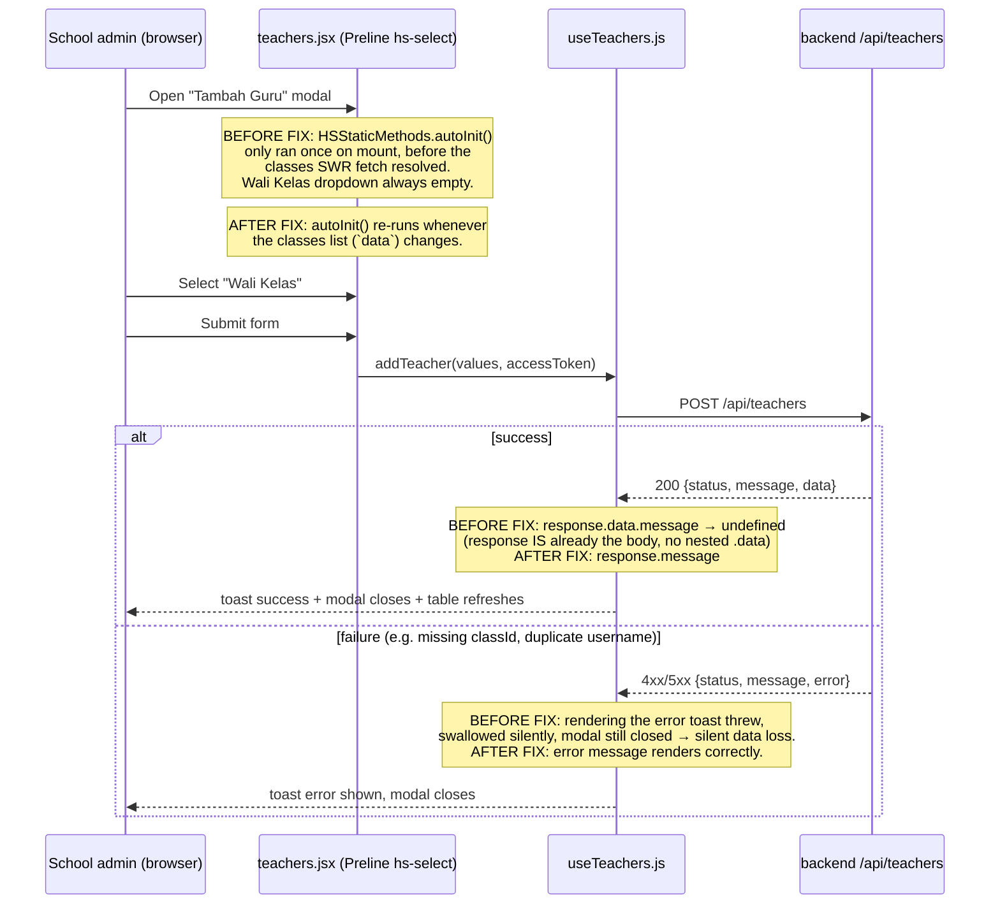
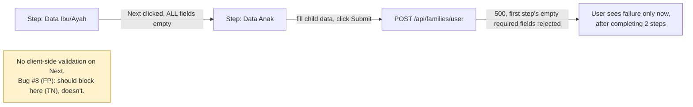

# QA Findings & Application Flow — Jalinan Anak Sehat

Last updated: 2026-09-08
Scope: two QA passes against production (`jalinananaksehat.com` / `apis.jalinananaksehat.com`), both via Playwright:
1. An initial exploratory pass (admin + fresh school/parent accounts).
2. A full **TP/TN/FP/FN** pass across **all four roles** (admin, school, parent, healthcare — healthcare tested for the first time), one role logged in and tested to completion at a time in a single browser session (running roles concurrently was tried first and abandoned — see [Methodology note](#methodology-note)).

**Methodology:** every test case is classified as:
- **TP (True Positive):** valid input/action → system correctly succeeds.
- **TN (True Negative):** invalid input/action → system correctly rejects/blocks it (clear error, not a crash).
- **FP (False Positive) — bug:** invalid input/action → system incorrectly *accepts* it (missing validation, or an authorization boundary that should block a role but doesn't).
- **FN (False Negative) — bug:** valid input/action → system incorrectly *rejects* or fails it (overly strict validation, broken widget, crash, silent failure).

## Bug tracker

| # | Feature / Page | Class | Severity | Status | Summary |
|---|---|---|---|---|---|
| 1 | School → Manajemen Guru → Tambah Guru | FN | 🔴 Critical | ✅ Fixed (`1f15c51`) | "Wali Kelas" dropdown never populated (Preline widget initialized before class data loaded), so submit always failed backend-side (`ID kelas harus disertakan`, 500). |
| 2 | School → Manajemen Guru → Tambah Guru (error handling) | FN | 🔴 Critical | ✅ Fixed (`1f15c51`) | On any submit failure, the error toast crashed internally (`response.data.message` on an already-unwrapped body) and the modal silently closed with zero feedback — looked identical to success. |
| 8 | Parent → Manajemen Keluarga wizard | FP | 🟠 High | 🟢 Open | The multi-step "Tambah Anggota Keluarga" wizard lets you click "Next" past the "Data Ibu/Ayah" step with every field left empty — no client-side validation at all. The empty step is only ever caught when the whole wizard is finally submitted (`POST /api/families/user` → 500) after the user has also filled in the following "Data Anak" step. No corrupt data is actually saved (backend is a real safety net), but the UX lets someone fill in an entire multi-step form before learning step 1 was invalid. |
| 9 | School → Manajemen Kelas → Tambah Kelas | FP-adjacent | 🟡 Minor | 🟢 Open | Submitting a duplicate class name (e.g. "QA-1" when it already exists) returns `POST /api/classes` → **200 OK**, but no new row is actually created — a false-success response. Not data-corrupting, but misleading (should be a 4xx explaining the name is taken). |
| 10 | Admin → Manajemen Pengguna → search + pagination | Minor | 🟡 Minor | 🟢 Open | Searching for a username while sitting on page 4 doesn't reset the page index: response comes back "Total Rows: 1" but the table shows "Tidak ada users tersedia" because it's still rendering page 4 of a 1-page result set. Data exists, just hidden until the user manually returns to page 1. |
| 11 | Admin → Manajemen Pengguna → Tambah Pengguna (duplicate username) | Debug leftover | 🟡 Minor | 🟢 Open | The duplicate-username rejection itself works correctly (TN), but a stray `console.error("hi")` fires in production during this path — debug leftover, should be removed. Also worth checking whether a duplicate-username conflict should be a `409`/`400` rather than `500`. |
| 12 | Parent → Pertanyaan (fresh account, no family data) | Minor | 🟡 Minor | 🟢 Open | A fresh parent account with no family members triggers 6 background `GET /api/response/checking/:id` requests (probing family-member IDs 1–6) that all 500, even though the page correctly shows "Silakan isi data keluarga terlebih dahulu" (that empty-state message itself is correct — TP). The failed background requests are wasted work, not a user-visible bug. |
| 3 | Admin → Dashboard vs Manajemen Pengguna | Minor | 🟡 Minor | 🟢 Open | "Total Pengguna" on the dashboard (28) didn't match "Total Rows" in Manajemen Pengguna (29) — off-by-one between the two counts for the same underlying data. |
| 4 | School → Manajemen Mitra → Tambah Mitra modal | Minor | 🟡 Minor | 🟢 Open | `Escape` doesn't close the modal; backdrop stays and blocks other clicks. Only the explicit Close button works. |
| 5 | Parent → Manajemen Keluarga → Tanggal Lahir field | Minor | 🟡 Minor | 🟢 Open | Datepicker calendar doesn't auto-close after a date is picked; its overlay intercepts clicks on other fields until dismissed manually. |
| 6 | Multiple pages (Manajemen Pengguna, Manajemen Pertanyaan, notifications) | Minor | 🟡 Minor | 🟢 Open | `/api/users`, `/api/notifications*` etc. sometimes fetched twice on a single page load. Wasteful, not breaking. |
| 7 | Cross-cutting — notifications / backend stability under load | Operational | ⚪ Info | 🟢 Recurring, not app-level | Seen twice now: `GET /api/notifications` failing with `500 ECONNRESET`, and during the heaviest QA run, a ~1–2 minute window where the whole site cycled through 500 → connection-timed-out → connection-closed before recovering on its own (response times briefly spiked to 5s+). Consistent with the DB-connection/LiteSpeed-worker pressure already diagnosed earlier this session, not a new app bug — flagging in case it recurs under real production traffic (may be worth a larger DB connection pool or more worker headroom). |

Previously fixed this same session, listed for context (infra, not app-feature bugs):
- Backend on Openship couldn't reach the database (Rumahweb firewall/IPS blocked the new server IP) — resolved once Rumahweb whitelisted `103.14.20.91`.
- 9 frontend API call sites double-prefixed `/api/api/...` (`admin/dashboardAPI.js`, `school/dashboardAPI.js`, `cityAPI.js` ×3, `healthcare/healthcareAPI.js`, `healthcare/dashboardAPI.js`, `classesAPI.js`, `parent/dashboardAPI.js` ×2) — fixed in `bde5728`.
- CI/CD: FTP deploys were silently landing in the wrong (jailed) directory on Rumahweb and never reaching the live app root — fixed by adding a server-side sync step in `0831f01`.

## Authorization boundary — clean sweep

All 4 roles × 3 foreign-role route groups (12 combinations: admin/school/parent/healthcare each attempting the other three's `/*` routes) were tested by direct URL navigation while authenticated. **Every single attempt correctly redirected back to the role's own dashboard** (`ProtectedRoute` in `src/routes/guardsRoute/ProtectedRoute.jsx` gates client-side by `user.role`) — no cross-role data or page access was possible in any direction. All 12 classified **TN**. No authorization bugs found.

## Results by role (TP/TN/FP/FN pass)

| Role | TP | TN | FP/FN bugs | Notes |
|---|---|---|---|---|
| Admin | 9 | 3 | #10, #11 | |
| School | 8 | 3 | #9 (Tambah Guru fix #1/#2 reverified genuinely resolved) | |
| Parent | 5 | 3 | #8 (high), #12 | |
| Healthcare | 8 | 3 | none | First time this role has ever been tested — came back clean. |

~40 test cases total. See git history of this file for the full case-by-case tables from the agent's raw report if needed; this file keeps the durable summary.

## Tested and working (no issues found)

- Auth: login (all 4 roles), logout, parent self-registration.
- Admin: Dashboard, Manajemen Pertanyaan (all 3 tabs), Daftar Instansi, Daftar Kategori, Tambah Pengguna (valid creation).
- School: Dashboard, Manajemen Guru (create + duplicate-rejection, confirming the earlier fix), Manajemen Kelas (valid create), Manajemen Murid (read), Manajemen Mitra (empty-state handling), Pertanyaan (fill "Pelayanan Kesehatan Sekolah" end-to-end, score computed correctly).
- Parent: Dashboard, Manajemen Keluarga (add family member + child end-to-end, nutrition status auto-computed correctly), Rekomendasi (renders correctly empty for a fresh account).
- Healthcare: Dashboard and all sidebar sections render without error against a brand-new, empty Puskesmas account (correct empty states, no crashes).

## Not yet tested

- Login edge cases (wrong password, empty fields) — all roles.
- IMT/BMI calculator widget on the public landing page.
- Edit/delete flows for most entities (mostly create was exercised; delete used only for QA cleanup).
- Admin "Manajemen Pertanyaan" edit-question flow (viewed only).
- Notifications panel UI (bell icon dropdown).
- Mobile/responsive layout.
- Extreme/malformed numeric inputs on the child growth-measurement form (attempted once, run interrupted by the transient backend instability noted in #7 — not retried).

---

## Application flow

See [`README.md`](../README.md) for the full role/routing diagram and account-provisioning flow. The two diagrams below cover QA-specific detail not in the README.

### "Tambah Guru" flow — where bugs #1 and #2 lived (now fixed)

### Manajemen Keluarga wizard — where bug #8 lives (open)

## Methodology note

An earlier attempt ran 4 QA agents in parallel, one per role, each in its own browser *tab* via `browser_tabs`. This failed: auth in this app is cookie-based (`withCredentials: true`, first-party refresh-token cookie), and cookies are shared browser-wide, not per-tab — every login by any of the 4 agents silently overwrote the session for all the others, corrupting every result after the first action or two. All 4 were stopped and re-run as a **single agent working through all 4 roles sequentially** (full login → test → logout before moving to the next role), which has no such race condition. If re-running this QA in the future, don't parallelize role testing on a shared browser instance unless using genuinely isolated browser contexts/profiles per role.

## Notes for future QA passes

- Test data created during QA must be cleaned up afterward — this pass ran directly against the production database (no staging environment exists). Institutions/users/classes prefixed `QA Test...` / `qa_test_...` / `qa2_...` / `verify_fix_...` are QA artifacts, not real data.
- The local dev server (`npm run dev`) proxies `/api` straight to the **production** backend (`API_PROXY_TARGET` in `.env`) — there is no local/staging backend. Any create/edit/delete tested locally also writes to production.
