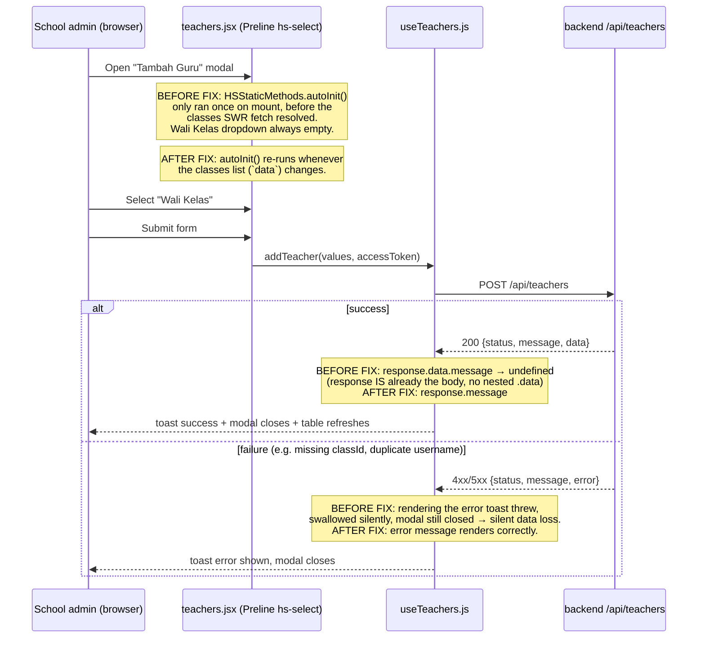

# QA Findings & Application Flow — Jalinan Anak Sehat

Last updated: 2026-09-08
Scope: full-app manual QA pass (Playwright, logged in as `admin`/`admin` + freshly created `school`/`parent` test accounts) against production (`jalinananaksehat.com` / `apis.jalinananaksehat.com`).

## Bug tracker

| # | Feature / Page | Severity | Status | Summary |
|---|---|---|---|---|
| 1 | School → Manajemen Guru → Tambah Guru | 🔴 Critical | ✅ Fixed (`1f15c51`) | "Wali Kelas" dropdown never populated (Preline widget initialized before class data loaded), so submit always failed backend-side (`ID kelas harus disertakan`, 500). |
| 2 | School → Manajemen Guru → Tambah Guru (error handling) | 🔴 Critical | ✅ Fixed (`1f15c51`) | On any submit failure, the error toast crashed internally (`response.data.message` on an already-unwrapped body) and the modal silently closed with zero feedback — looked identical to success. |
| 3 | Admin → Dashboard vs Manajemen Pengguna | 🟡 Minor | 🟢 Open | "Total Pengguna" on the dashboard (28) didn't match "Total Rows" in Manajemen Pengguna (29) — off-by-one between the two counts for the same underlying data. |
| 4 | School → Manajemen Mitra → Tambah Mitra modal | 🟡 Minor | 🟢 Open | `Escape` doesn't close the modal; backdrop stays and blocks other clicks. Only the explicit Close button works. |
| 5 | Parent → Manajemen Keluarga → Tanggal Lahir field | 🟡 Minor | 🟢 Open | Datepicker calendar doesn't auto-close after a date is picked; its overlay intercepts clicks on other fields until dismissed manually. |
| 6 | Multiple pages (Manajemen Pengguna, Manajemen Pertanyaan, notifications) | 🟡 Minor | 🟢 Open | `/api/users`, `/api/notifications*` etc. sometimes fetched twice on a single page load. Wasteful, not breaking. |
| 7 | Cross-cutting — notifications | ⚪ Info | 🟢 Not reproducible | One `GET /api/notifications` failed once with `500 ECONNRESET`. Not seen again — looks like a transient DB connection drop, not deterministic. |

Previously fixed this same session, listed for context (not app-feature bugs, infra):
- Backend on Openship couldn't reach the database (Rumahweb firewall/IPS blocked the new server IP) — resolved once Rumahweb whitelisted `103.14.20.91`.
- 9 frontend API call sites double-prefixed `/api/api/...` (`admin/dashboardAPI.js`, `school/dashboardAPI.js`, `cityAPI.js` ×3, `healthcare/healthcareAPI.js`, `healthcare/dashboardAPI.js`, `classesAPI.js`, `parent/dashboardAPI.js` ×2) — fixed in `bde5728`.
- CI/CD: FTP deploys were silently landing in the wrong (jailed) directory on Rumahweb and never reaching the live app root — fixed by adding a server-side sync step in `0831f01`.

## Tested and working (no issues found)

- Auth: login (admin/admin), logout, parent registration, login as newly-registered accounts.
- Admin: Dashboard, Manajemen Pertanyaan (all 3 tabs), Daftar Instansi, Daftar Kategori, Tambah Pengguna (creates institution + admin).
- School: Dashboard, Manajemen Kelas (create), Manajemen Murid (read), Manajemen Mitra (empty-state handling), Pertanyaan (fill "Pelayanan Kesehatan Sekolah" end-to-end, score computed correctly).
- Parent: Dashboard, Manajemen Keluarga (add family member + child end-to-end, nutrition status auto-computed correctly, all dropdowns including Kelas/Sekolah populate correctly here — confirming bug #1 is isolated to the Teacher form).

## Not yet tested

- Login edge cases (wrong password, empty fields).
- IMT/BMI calculator widget on the public landing page.
- Parent "Rekomendasi" (recommendations) page.
- Parent questionnaire fill flow (only the school one was tested).
- Edit/delete flows for most entities (only create was exercised).
- Admin "Manajemen Pertanyaan" edit-question flow (viewed only).
- Notifications panel UI (bell icon dropdown).
- Healthcare/Puskesmas role entirely (no account existed to test with).
- Mobile/responsive layout.

---

## Application flow

### Roles and top-level navigation

```mermaid
flowchart TD
    Landing["/landing-page (public)"] --> Login["/auth/login"]
    Landing --> Register["/auth/register"]
    Login -->|role: admin| AdminDash
    Login -->|role: school| SchoolDash
    Login -->|role: parent| ParentDash
    Login -->|role: healthcare| HealthDash

    subgraph Admin["Admin"]
        AdminDash["/admin/dashboard"]
        AdminUsers["/admin/management-users"]
        AdminQuestion["/admin/question"]
        AdminInstitution["/admin/institution"]
        AdminCategory["/admin/category"]
    end

    subgraph School["School"]
        SchoolDash["/school/dashboard"]
        SchoolTeachers["/school/management-teachers"]
        SchoolClasses["/school/management-classes"]
        SchoolStudents["/school/management-students"]
        SchoolPartners["/school/management-partners"]
        SchoolQuesioner["/school/quesioner"]
    end

    subgraph Parent["Parent"]
        ParentDash["/parent/dashboard"]
        ParentFamily["/parent/management-family"]
        ParentQuesioner["/parent/quesioner"]
        ParentRecommendation["/parent/recommendation"]
    end

    subgraph Healthcare["Healthcare / Puskesmas"]
        HealthDash["/healthcare/dashboard"]
        HealthRecs["/healthcare/list-of-recommendations"]
        HealthFollowUp["/healthcare/follow-up"]
        HealthHistory["/healthcare/treatment-history"]
        HealthStaff["/healthcare/staff-management"]
    end
```

### "Tambah Guru" flow — where bugs #1 and #2 lived

## Notes for future QA passes

- Test data created during QA must be cleaned up afterward — this pass ran directly against the production database (no staging environment exists yet). Institutions/users/classes prefixed `QA Test...` / `qa_test_...` / `verify_fix_...` are QA artifacts, not real data.
- The local dev server (`yarn dev`) proxies `/api` straight to the **production** backend (`API_PROXY_TARGET` in `.env`) — there is no local/staging backend. Any create/edit/delete tested locally also writes to production.
